# Traveling Salesman Problem Solver

## Introduction
This web application solves the Traveling Salesman Problem (TSP) using three optimization algorithms: Genetic Algorithm (GA), Particle Swarm Optimization (PSO), and Ant Colony Optimization (ACO). The TSP is a classic optimization problem where the goal is to find the shortest possible route that visits a set of cities and returns to the starting city. The Genetic Algorithm, Particle Swarm Optimization, and Ant Colony Optimization are popular metaheuristic algorithms used to tackle combinatorial optimization problems like the TSP.

## Genetic Algorithm (GA)

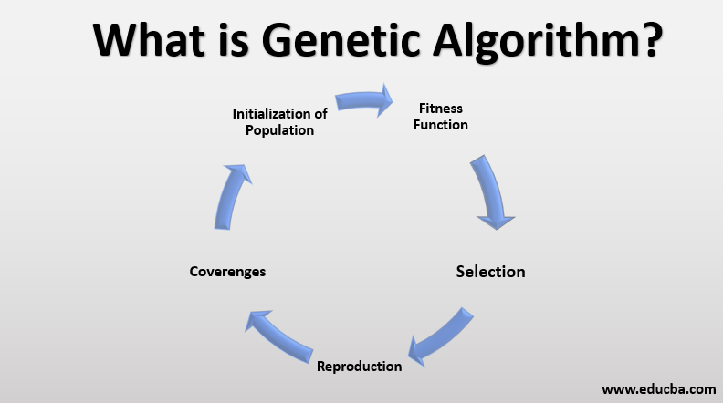

### Overview
The Genetic Algorithm is a population-based optimization algorithm that iteratively evolves a population of solutions to find the best solution. It operates on a set of customizable parameters and functions.

### Parameters
- Population Size: The number of individuals (solutions) in each generation.
- Generation Count: The maximum number of generations the algorithm will run.
- Mutation Rate: The probability of an individual's gene being mutated during reproduction.
- Selection Size: The number of individuals selected as parents for the next generation.
- Crossover Rate: The probability of two parents exchanging genetic information during reproduction.

### Selection Functions
The Genetic Algorithm supports the following selection functions:
- Random Selection: Individuals are selected randomly without considering their fitness.
- Best Selection: Individuals are selected by sorting them from best to worst based on their fitness.
- Roulette Wheel Selection: Individuals are selected with probabilities proportional to their fitness values.
- Tournament Selection: A random subset of individuals competes, and the fittest individual is selected.
- Rank Selection: Individuals are selected based on their rank in the population sorted by fitness.

### Crossover Functions
The Genetic Algorithm supports the following crossover functions:
- Partially Mapped Crossover (PMX): Creates offspring by partially exchanging genetic information between two parents.
- Cycle Crossover (CX): Creates offspring by exchanging genetic information based on cycle patterns between two parents.
- Order Crossover (OX): Creates offspring by partially exchanging genetic information between two parents while preserving the order.

### Mutation Functions
The Genetic Algorithm supports the following mutation functions:
- Swap Mutation: Randomly swaps two cities in an individual's route.
- Insert Mutation: Randomly inserts a city from one position to another in an individual's route.
- Inversion Mutation: Randomly selects a subroute and reverses its order in an individual's route.
- Scramble Mutation: Randomly shuffles a subroute in an individual's route.

### Replacement Functions
The Genetic Algorithm supports the following replacement functions for generating the next generation:
- New Generation: The offspring completely replace the previous generation.
- Best Replacement: The best individuals from the previous generation are preserved in the next generation.
- Best-Half Replacement: Half of the individuals from the previous generation are preserved based on their fitness, and the other half comes from the best individuals of the new generation.
- New-Best-Old Replacement: All individuals from the new generation are preserved, and one individual comes from the best individual of the previous generation.

## Particle Swarm Optimization (PSO)

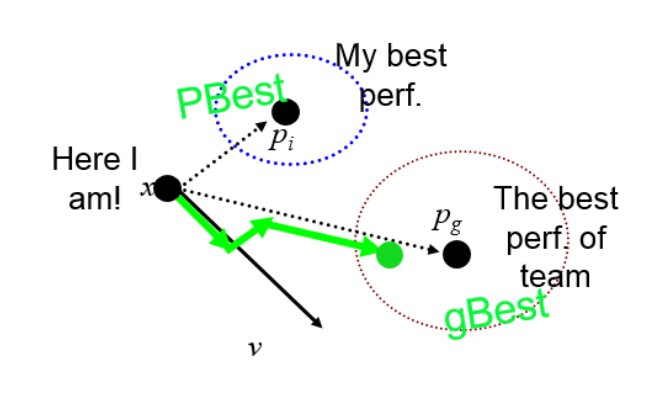

### Overview
Particle Swarm Optimization is a swarm intelligence-based optimization algorithm inspired by the collective behavior of bird flocking or fish schooling. It iteratively searches for the optimal solution by simulating the movement and interaction of particles in a multi-dimensional search space.

### Parameters
- Number of Iterations: The maximum number of iterations the algorithm will run.
- Number of Particles: The number of particles in the swarm.
- Inertia Weight: Controls the impact of the particle's previous velocity on the current velocity.
- Personal Coefficient: Controls the particle's attraction to its personal best solution.
- Global Coefficient: Controls the particle's attraction to the global best solution.

### Update Equation
The particle's position and velocity are updated using the following equation:

Position Update:
x(i,t+1) = v(i,t) + x(i,t)

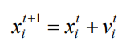

Velocity Update:
v(i,t+1) = w * v(i,t) + c1 * U1(t) * (pbest(i,t) - x(i,t)) + c2 * U2(t) * (gbest(i,t) - x(i,t))

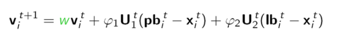

- x(i,t): The position of the dimension i in step t.
- v(i,t): The velocity of the dimension i in step t.
- w: Inertia weight.
- c1: Personal coefficient.
- c2: Global coefficient.
- U1(t): A random value between 0 and 1 in step 1.
- U2(t): A random value between 0 and 1 in step 1.
- pbest(i,t): The personal best position of dimension i in step t.
- gbest(i,t): The global best position of dimension i in step t.
- lbest(i,t): The local best position of dimension i in step t.
- gbest and lbest can be substituted for each other.

## Ant Colony Optimization (ACO)

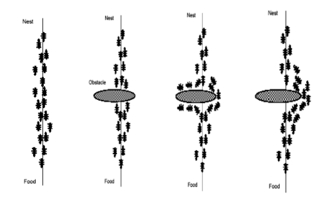

### Overview
Ant Colony Optimization is a metaheuristic optimization algorithm inspired by the foraging behavior of ants. It uses a population of artificial ants to iteratively construct solutions and update pheromone trails to guide future iterations.

### Parameters
- Number of Ants: The number of artificial ants in the colony.
- Number of Iterations: The maximum number of iterations the algorithm will run.
- Evaporation Rate: The rate at which pheromone trails evaporate.
- Initial Pheromone: The initial amount of pheromone on each edge.
- Alpha: The power of pheromone in the ant system formula.
- Beta: The power of heuristic value in the ant system formula.

### Construction of Solutions
The artificial ants construct solutions using the following probability formula(Ant System):

P(i,j) = (T(i,j)^α) * (N(i,j)^β) / Σ((T(i,j)^α) * (N(i,j)^β))

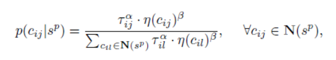

- P(i,j): Probability of choosing edge (i,j).
- T(i,j): Pheromone value on edge (i,j).
- N(i,j): Heuristic value of edge (i,j).
- α: The power of pheromone.
- β: The power of heuristic value.

### Updating Pheromone Trails
The pheromone trails are updated using the following formula:

T(i,j) = (1-p) * T(i,j) + p * (1/d(t))

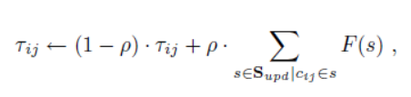

- T(i,j): Pheromone value on edge (i,j).
- p: Evaporation rate.
- d(t): Total distance of the path.

### Heuristic 
The heuristic value for every cij:

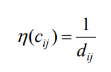

## Usage
1. Install the required libraries listed in the `requirements.txt` file.
2. Make sure you have Python 3.9.7 installed.
3. Open the terminal and navigate to the parent directory of the `TSPApp` folder.
4. Run the following command to start the web application: `bokeh serve --show TSPApp`
5. The application will be accessible in your browser at `http://localhost:5006/TSPApp`.
6. Select a graph .csv file that represents the cities and distances.
7. Choose the algorithm: Genetic Algorithm, Particle Swarm Optimization, or Ant Colony Optimization.
8. Customize the parameters and functions according to your preferences.
9. Click the "start" button to start the optimization process.
10. The application will display the best-found route and its total distance.
11. You can repeat the process with different configurations or resume the algorithm to run for more iterations.

## UI
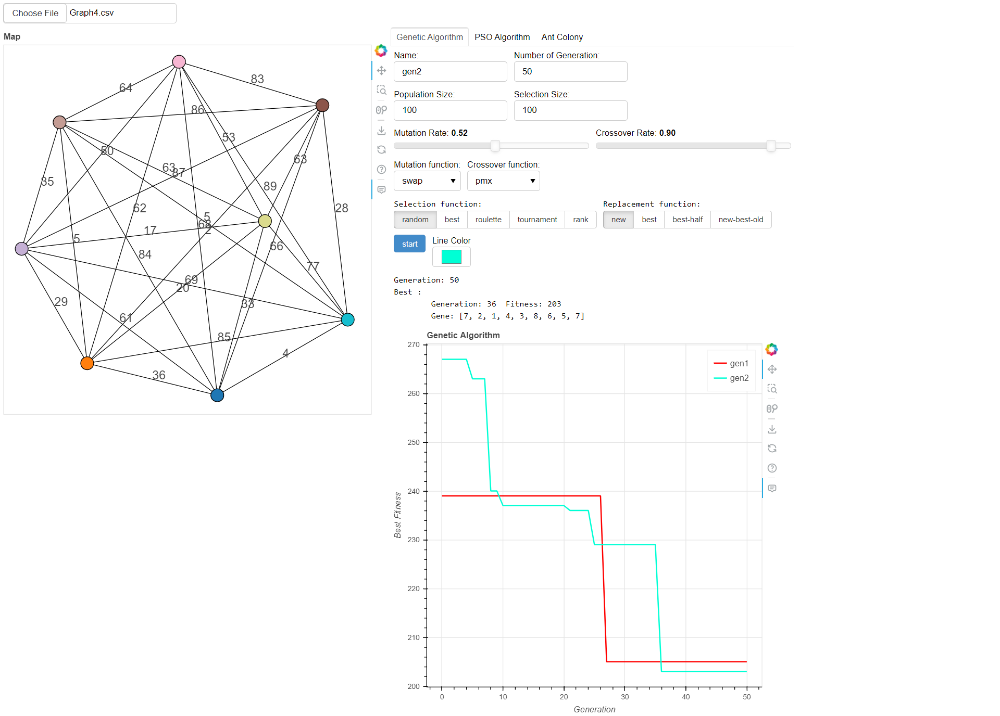

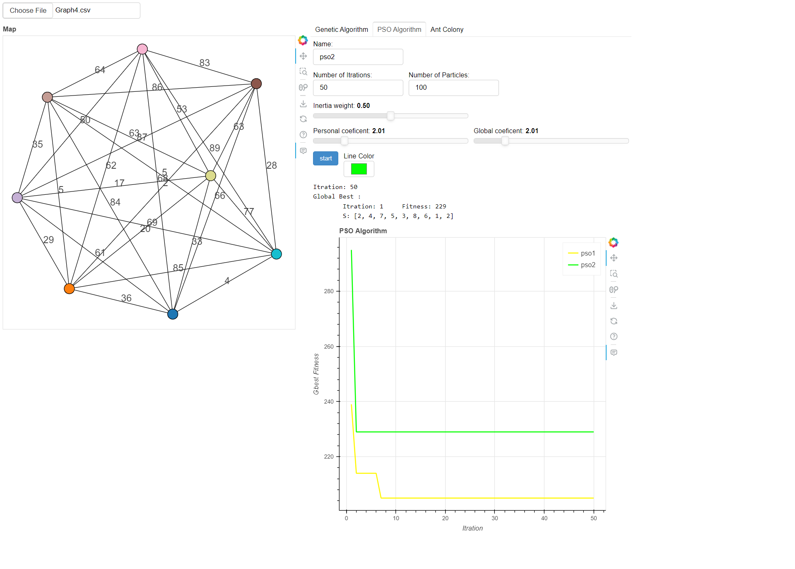

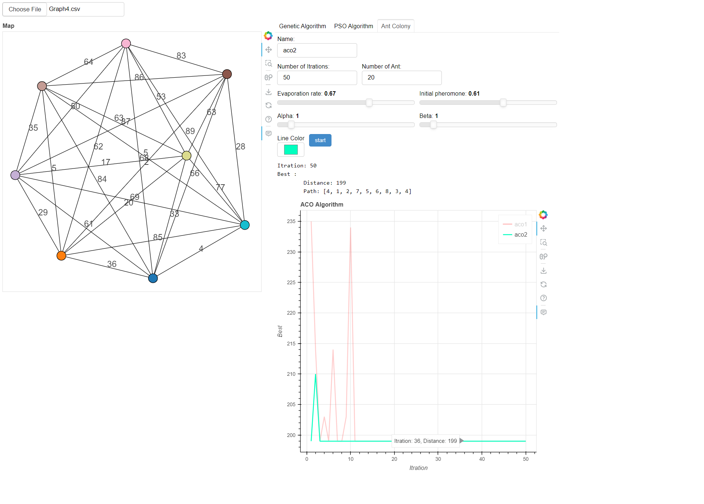

## Results
The application provides a visual representation of the TSP route found by the chosen algorithm. It plots the cities on a map and connects them according to the optimal route discovered. Additionally, it displays the total distance of the best-found solution.

## Contributing

Contributions are welcome! If you have any ideas, improvements, or bug fixes, please open an issue or submit a pull request.

## License

This project is licensed under the MIT License. See the [LICENSE](License.md) file for more information.

## Conclusion
By using this web application, you can experiment with different configurations of the Genetic Algorithm, Particle Swarm Optimization, and Ant Colony Optimization to solve the Traveling Salesman Problem. The customizable parameters and functions allow you to fine-tune the algorithms' behavior and explore the effectiveness of different techniques and methods.